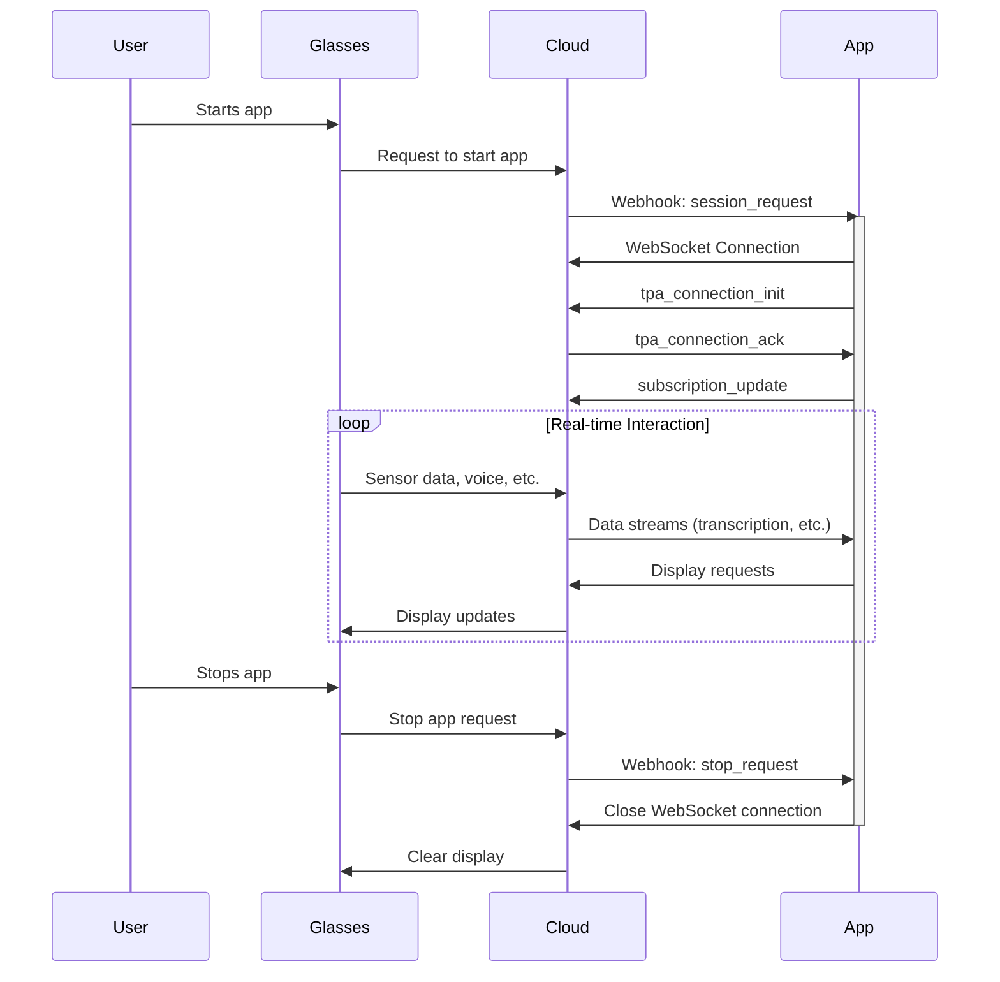

# App Lifecycle

> Understand how a MentraOS app registers, initializes a session, connects to the cloud, subscribes to events, updates the display, and terminates cleanly.

# App Lifecycle

This document describes the lifecycle of an MentraOS app within the MentraOS ecosystem. Understanding this lifecycle is crucial for building robust and responsive apps.

## Stages of the App Lifecycle

An MentraOS app goes through the following stages:

1. **Registration (One-time):**  This happens outside of the normal runtime flow. You register your app with [MentraOS Developer Portal](https://console.mentra.glass/apps), providing:

   * `packageName`: A unique identifier (e.g., `com.example.myapp`).
   * `name`: A human-readable name.
   * `description`: A description of your app.
   * `webhookURL`: The URL where MentraOS Cloud will send session start requests.
   * `logoURL`: (Optional) URL to your app's logo.
   * `apiKey`: A secret key for authenticating your app with the cloud.
   * `permissions`: An array of permissions your app needs.  See the [Permissions](permissions) guide for details.

   This automatically installs the app for your user.  For other people to test the app (including others in your organization), they need to install the app.  Get the app install link from the App edit page under the `Share with Testers` section.

2. **Session Request (Webhook):** When a user starts your app on their smart glasses, MentraOS Cloud sends an HTTP POST request to your app's `webhookURL`. This request includes:

   * `type`: `"session_request"`
   * `sessionId`: A unique identifier for this session.
   * `userId`:  The ID of the user who started the app.
   * `timestamp`: When the request was sent.

   Your app server should listen for these POST requests on the configured `webhookPath` (default: `/webhook`).

3. **WebSocket Connection:**  Upon receiving the `session_request`, your app establishes a WebSocket connection to MentraOS Cloud. The [`AppServer`](/reference/app-server) class in the SDK handles this for you automatically. You provide the cloud's WebSocket URL in the [`AppServerConfig`](/reference/app-server#configuration):

   ```typescript
   const server = new AppServer({
     packageName: PACKAGE_NAME,
     apiKey: API_KEY,
     port: PORT,
     mentraOSWebsocketUrl: `ws://localhost:${CLOUD_PORT}/app-ws`, // Or your cloud URL
     webhookPath: '/webhook',
   });
   ```

4. **Connection Initialization:**  After connecting, your app sends a [`tpa_connection_init`](/reference/interfaces/message-types#appconnectioninit) message to the cloud. This message includes:

   * `type`: `"tpa_connection_init"`
   * `sessionId`:  The session ID from the webhook request.
   * `packageName`:  Your app's package name.
   * `apiKey`:  Your app's API key.

   The [`AppSession`](/reference/app-session) class handles sending this message automatically.

5. **Subscription:**  Your app subscribes to the data streams it needs (e.g., [transcription](/reference/interfaces/event-types#transcriptiondata), [head position](/reference/interfaces/event-types#headposition)) using the [`subscribe()`](/reference/app-session#subscribe) method or the [`events`](/reference/managers/event-manager) object (see [Events](./events) for details). This informs MentraOS Cloud which data to send to your app.

6. **Event Handling:**  Your app receives real-time events from MentraOS Cloud via the WebSocket connection. You handle these events using event listeners (e.g., [`session.events.onTranscription()`](/reference/managers/event-manager#ontranscription)).

7. **Display Updates:**  Your app sends display requests to MentraOS Cloud to control what is shown on the glasses' display. You use the [`LayoutManager`](/reference/managers/layout-manager) (accessible through `session.layouts`) to create and send these requests.

8. **Session Termination:**  The session ends when:

   * The user stops the app on their glasses.
   * The glasses disconnect from the cloud.
   * Your app explicitly disconnects.
   * An error occurs that terminates the session.

   MentraOS Cloud will send a [`stop_request`](/reference/interfaces/webhook-types#stopwebhookrequest) webhook to your app when a session ends. You can override the [`onStop`](/reference/app-server#onstop-protected) method in your [`AppServer`](/reference/app-server) to handle any necessary cleanup. The [`AppSession`](/reference/app-session) also emits a [`disconnected`](/reference/managers/event-manager#ondisconnected) event.

## Important Implementation Details

> **IMPORTANT:** After making changes to your app code or restarting your server, you must restart your app inside the MentraOS phone app.

This restart is necessary because the MentraOS phone app maintains a connection to your cloud app. When you make code changes or restart your server, you need to establish a fresh connection.

## Example Lifecycle Flow



